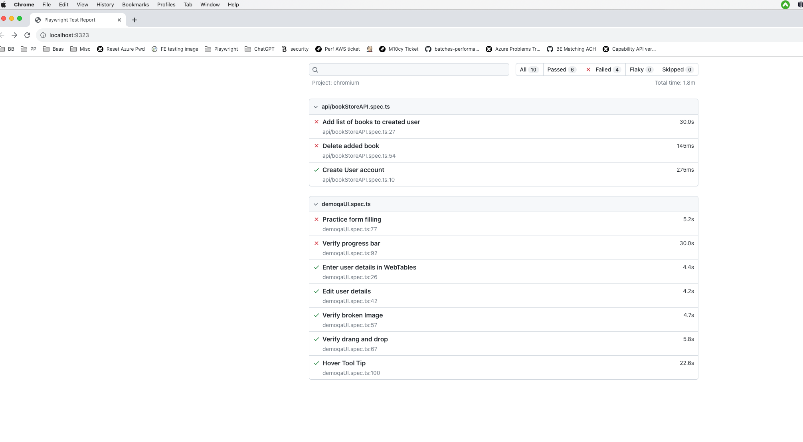

# Playwright tests for https://demoqa.com website

# Quick Start

### Install Dependencies

`npm i`

### Install browsers

`npx playwright install`

# Run Tests

All the UI tests for demoqa.com are present in file : demoqa-web-ui.spec.ts
All the API tests for Book store application are present in file : store-book-api.spec.ts
UI Tests: src/test/demoqa-web-ui.spec.ts
API Tests: src/test/store-book-api.spec.ts

`npx playwright test`

---

## About

## List all test titles

`npx playwright test --list`

---

## File Structure

    .
    ├── bin                     # Example CLI commands
    ├── node_modules            # Dependencies
    ├── src                     # Project
    │   ├── data                # Test data
    │   ├── models              # Classes representing functionality
    │   └── pages               # Page object classes of a demoqa website
    │   ├── requests            # request json files for api tests
    │   └── test                # Contains api and ui tests
    ├── package.json            # Project metadata
    ├── package-lock.json       # Describes dependency tree
    ├── playwright.config.ts    # Playwright test configuration
    └── README.md               # This file

## Test report

📝 **Features**

✅ UI automation with Page Object Model for demoQA.com
✅ API validations for Book Store endpoints
💼 Modular folder structure (data, models, pages, requests, tests)
⏱️ Easily configurable via customConfig.config.ts
🧪 Ready for powerful Playwright Test features (parallelism, retries, tracing, reports)

🛠️ **Customization & Configuration**

Edit customConfig.config.ts to:
Change base URL
Toggle headless vs headed mode
Adjust timeouts, retries, etc.

Manage environment variables if needed by extending the Playwright config or adding .env.

🧩 **Extending the Framework**

To add new tests:
Add UI pages: Place new POM classes in src/pages/
Add API requests: Create JSON payloads under src/requests/
Write test specs under src/test/
Run with npx playwright test

📊 **Reports & Debugging**

Playwright generates HTML reports by default. You can enable screenshots, trace files, and videos via playwright.config.ts for flaky test analysis.

🤝 **Contributing**

Feel free to open issues or PRs. Ideas for CI/CD integration, more demos, or config profiles are welcome!

📄 **License**

MIT License — Use, modify, share, just don’t hold me responsible 😉
